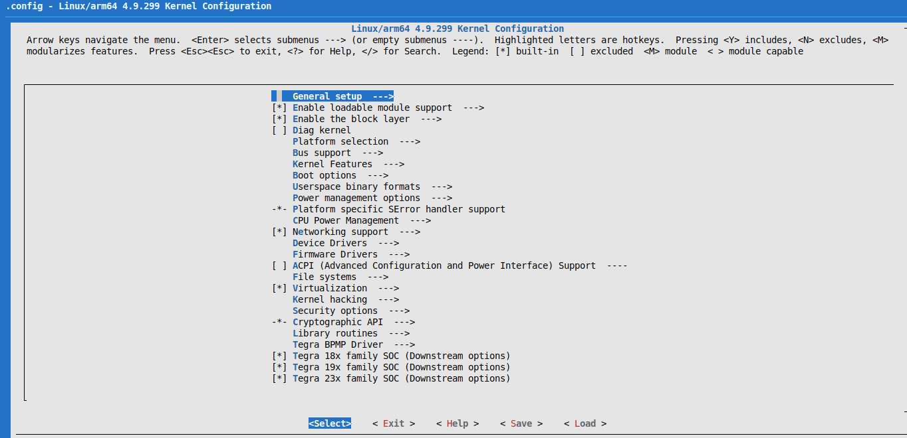
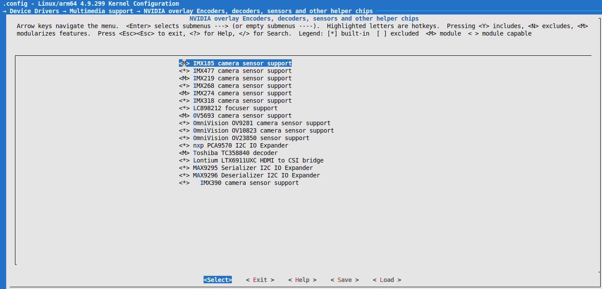

# Jetson-Kernel-Development
Jetson environment for kernel modules development

**Table Of Contents**
- [Description](#description)
- [Enviroment](#enviroment)
- [Prerequisites](#prerequisites)
- [How to build and customize the kernel](#How-to-build-and-customize-the-kernel)
- [Copy binaries to Jetson](#Copy-binaries-to-Jetson)
- [Additional resources](#additional-resources)
- [Changelog](#changelog)
- [Known issues](#known-issues)
- [Details](#Details)

## Description
The Jetson Kernel Development environment allows you to build linux-tegra kernel through shell scripts by cross-compiling a monolithic kernel image with drivers as built-in, cross-compiling modules as kernel objects and load them to your image and compiling the board device tree.

## Enviroment
This environment was tested with
- [x] PC Ubuntu 20.04 OS
- [x] NVIDIA Jetson Nano Development Kit 

## Prerequisites
Run in a terminal the script below to install the environment requirements

`cd $HOME/Jetson-Kernel-Development/scripts/`

`sh install_requirements.sh` 


## How to build and customize the kernel

### Configure the kernel
Genereate the .config file by running

`chmod a+x defconfig.sh`

`./defconfig.sh`

Apply your changes by disabling [] / enabling [*] drivers or mark the loadable modules [M]

`chmod a+x menu_config.sh`

`./menu_config.sh`

A GUI will be opened in your terminal



You can browse through the menuconfig console to see all the available drivers, you can find below nvidia overlays encoders, decoders and image sensor drivers



### Clean environment
Run in a terminal the command below to build the kernel

`./build_and_copy.sh clean`

### Build kernel
Run in a terminal the command below to build the kernel

`./build_and_copy.sh kernel`

### Build kernel modules
Run in a terminal the command below to build the kernel modules

`./build_and_copy.sh modules`

### Build device tree
Run in a terminal the command below to build the device tree

`./build_and_copy.sh dtb`

## Copy binaries to Jetson

## Copy Image and DTB (Device Tree Blob)
Once you've build your custom kernel, you can copy both of the custom image and dtb by running the script below

`./copy_img_dtb.sh <YOUR_JETSON_PROFILE>`

## Copy a kernel object

To copy a specific kernel module into your jetson board
1. Source the evironment
```
cd $HOME/Jetson-Kernel-Development/scripts/
source utils.sh
cd $TEGRA_KERNEL_OUT/
```

2. Copy the kernel module to the jetson
```
scp $TEGRA_KERNEL_OUT/<PATH_TO_YOUR_KERNEL_MODULE> <YOUR_JETSON_PROFILE>@192.168.55.1:/home/<JETSON_PROFILE>/
```

3. Load the kernel module
```
ssh <YOUR_JETSON_PROFILE>@192.168.55.1
sudo insmod <KERNEL_MODULE>.ko
```

4. Remove the module
```
sudo rmmod <KERNEL_MODULE>.ko
```


